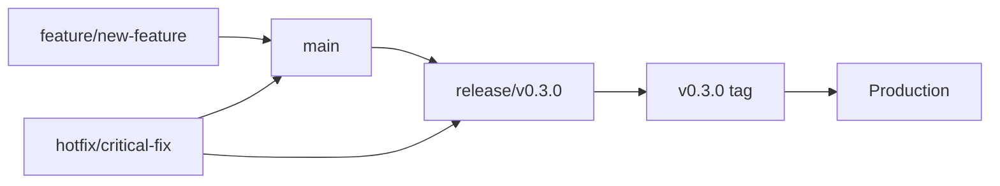

# Contributing to NHL 3-Point Standings

Thank you for your interest in contributing to the NHL 3-Point Standings project! This guide outlines our development workflow, branching strategy, and contribution standards.

## 📋 Quick Start

1. **Fork and clone** the repository
2. **Create a feature branch** from `main`
3. **Use conventional commits** for all changes
4. **Run local validation** before pushing
5. **Create a Pull Request** to `main`

## 🌳 Branching Strategy

We use a **Feature Branch Workflow** with optional **Release Branches** for controlled deployments.

### Branch Types

| Branch Type | Purpose | Naming Convention | Example |
|-------------|---------|-------------------|---------|
| `main` | Production-ready code | `main` | `main` |
| Feature | New features or enhancements | `feat/description` | `feat/user-authentication` |
| Bugfix | Bug fixes | `fix/description` | `fix/position-numbering` |
| Hotfix | Critical production fixes | `hotfix/description` | `hotfix/security-patch` |
| Release | Release preparation | `release/vX.X.X` | `release/v0.3.0` |

### Development Workflow



## 🚀 Development Process

### 1. Creating a Feature Branch

```bash
# Start from latest main
git checkout main
git pull origin main

# Create and switch to feature branch
git checkout -b feat/awesome-new-feature
```

### 2. Development with Conventional Commits

Use [Conventional Commits](https://www.conventionalcommits.org/) format:

```bash
# Features (minor version bump)
git commit -m "feat: add user dashboard with team statistics"
git commit -m "feat(ui): implement dark mode toggle"

# Bug fixes (patch version bump)
git commit -m "fix: resolve incorrect position numbering in standings table"
git commit -m "fix(api): handle null team logo URLs gracefully"

# Breaking changes (major version bump)
git commit -m "feat!: redesign API endpoints for v2"
# or
git commit -m "feat: redesign API endpoints

BREAKING CHANGE: All endpoints now require authentication headers"

# Other types
git commit -m "docs: update API documentation"
git commit -m "test: add integration tests for standings service"
git commit -m "chore: update dependencies to latest versions"
git commit -m "style: fix linting issues in components"
git commit -m "refactor: extract business logic into services"
```

### 3. Local Validation

Before pushing, run our validation suite:

```bash
# Quick validation (runs automatically on commit)
npm run lint
npm run check
npm test

# Full validation (runs automatically on push)
npm run release:prepare
```

### 4. Creating Pull Requests

```bash
# Push feature branch
git push origin feat/awesome-new-feature

# Create PR through GitHub UI or CLI
gh pr create --title "feat: add awesome new feature" --body "Description of changes"
```

**PR Requirements:**
- ✅ All CI checks must pass
- ✅ Code review approval required
- ✅ Conventional commit format
- ✅ Tests included for new features
- ✅ Documentation updated if needed

### 5. Merging Strategy

**Use "Squash and Merge"** to maintain clean history:
- Squashes all feature commits into one
- Ensures conventional commit format in main branch
- Enables proper semantic-release versioning

## 📦 Release Strategy

We support two release approaches:

### Option A: Continuous Releases (Default)

Every merge to `main` can trigger an automatic release via semantic-release:

```bash
feat/auth → main → automatic v0.3.0 release
```

### Option B: Controlled Releases with Release Branches

Accumulate features on `main`, then create release branches for controlled deployment:

```bash
# Accumulate features on main
feat/auth → main
feat/ui-improvements → main
feat/new-dashboard → main

# Create release branch when ready
git checkout main
git checkout -b release/v0.3.0

# Finalize release
npm run release:prepare
npm run semantic-release

# Merge back to main
git checkout main
git merge release/v0.3.0
```

## 🛠️ Development Commands

### Essential Commands

```bash
# Development
npm run dev                    # Start development servers
npm run dev:frontend          # Start frontend only
npm run dev:server            # Start GraphQL server only

# Quality Assurance
npm run lint                  # Lint all code
npm run lint -- --fix        # Auto-fix linting issues
npm run check                 # Type checking
npm run test                  # Run all tests
npm run test:coverage         # Run tests with coverage

# Building
npm run build                 # Build all packages
npm run clean                 # Clean build artifacts

# Release Management
npm run version:bump:patch    # Manual version bump (patch)
npm run version:bump:minor    # Manual version bump (minor)
npm run version:bump:major    # Manual version bump (major)
npm run release:prepare       # Full release validation
npm run semantic-release      # Automated release
```

### Docker Commands

```bash
npm run docker:up             # Start development containers
npm run docker:down           # Stop containers
npm run docker:logs           # View container logs
npm run docker:clean          # Clean up containers and images
```

## 🏗️ Project Structure

```
3point-game-nhl-standing/
├── frontend/                 # SvelteKit frontend application
│   ├── src/
│   │   ├── components/       # Reusable UI components
│   │   ├── business/         # Business logic layer
│   │   ├── stores/          # Svelte stores
│   │   └── utils/           # Utility functions
├── graphql-server/          # Fastify GraphQL server
│   ├── src/
│   │   ├── graphql/         # GraphQL schemas and resolvers
│   │   ├── config/          # Configuration management
│   │   └── utils/           # Server utilities
├── shared/                  # Shared constants and types
├── scripts/                 # Build and release scripts
├── .github/workflows/       # CI/CD workflows
└── docs/                    # Documentation
```

## 🧪 Testing Guidelines

### Test Requirements

- **New features** must include tests
- **Bug fixes** should include regression tests
- **Maintain coverage** above 80% where possible

### Test Types

```bash
# Unit tests
npm run test:frontend         # Frontend unit tests (Vitest)
npm run test:server          # Server unit tests (Jest)

# Integration tests
npm run test:coverage        # Full test suite with coverage

# E2E tests (when implemented)
npm run test:e2e             # End-to-end tests
```

## 📝 Code Standards

### TypeScript

- Use **strict TypeScript** configuration
- Avoid `any` types - use proper typing
- Export interfaces and types for reusability

### Code Style

- **ESLint** for code quality
- **Prettier** formatting (automatic via pre-commit)
- **Conventional naming** for files and functions

### Component Guidelines

- **Single responsibility** - one concern per component
- **Props interface** - define clear component APIs
- **Business logic** - extract to services, not in components
- **Error boundaries** - handle errors gracefully

## 🔒 Security Guidelines

- **Never commit secrets** or API keys
- **Audit dependencies** regularly (`npm audit`)
- **Review security alerts** in GitHub
- **Follow OWASP guidelines** for web security

## 🐛 Reporting Issues

### Bug Reports

Include:
- **Steps to reproduce**
- **Expected vs actual behavior**
- **Environment details** (browser, Node version)
- **Screenshots** if applicable

### Feature Requests

Include:
- **Use case description**
- **Proposed solution**
- **Alternative approaches considered**

## 🤝 Code Review Process

### For Authors

- **Self-review** your changes before requesting review
- **Write descriptive** PR descriptions
- **Respond promptly** to review feedback
- **Keep PRs focused** - one feature per PR

### For Reviewers

- **Be constructive** and helpful
- **Focus on code quality** and maintainability
- **Check for test coverage**
- **Verify conventional commit format**

## 📚 Additional Resources

- [Semantic Versioning](https://semver.org/)
- [Conventional Commits](https://www.conventionalcommits.org/)
- [Release Process](./RELEASE.md)
- [Project README](./README.md)

## ❓ Getting Help

- **Create an issue** for bugs or questions
- **Check existing issues** before creating new ones
- **Join discussions** for feature planning

---

Thank you for contributing to the NHL 3-Point Standings project! 🏒