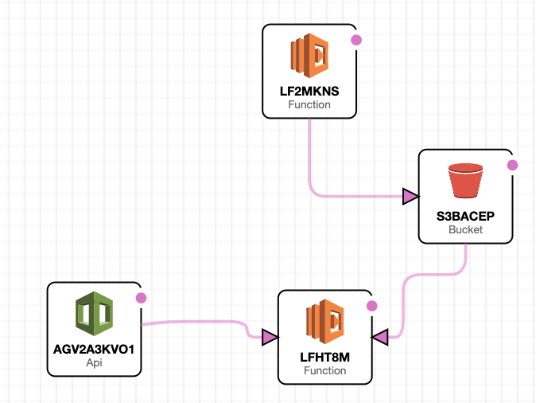

# NHL 3 Point System

---
## About this Project

This effort is purely to make it easier for stats nerds and the like to make and showcase what the NHL standings would be if the Games were worth 3 points, hence abiding to IIHF rules and not _artificially_ narrowing the gap between teams. 

## Roadmap

So far, the back-end is done (fetching and organising data)
Here is what remains to be done:
- Front-end development (Vue or Svelte TBD)
- Deployment to AWS || GCP
- Storing data in Cache/DB

## Stack Architecture
Here is a very simple diagram of what the architecture looks like:

## Contributing

I am only one person so if you see something I have missed please feel free to 
open up a MR/PR and I will get it merged.  Generally speaking I get things done
in a few days as time permits between work and other obligations.

## Contact
You can reach me by mp, I'll think if Gitter makes sense, but since this is probably a very insignificant project, I don't expect an overwhelming popularity :grin:

## Acknowledgements

[Drew Hynes](https://gitlab.com/dword4/nhlapi) This is the resource that really got me bootstraped to this project.

By inheritance, I also have to thank the 2 following developer along with their projects.

[Kevin Sidwar](https://www.kevinsidwar.com/) - First real source of documentation I found on the API and gave me
a nice starting point for a project that eventually evolved into this repository

[Jon Ursenbach](https://github.com/erunion) - Built out an [OpenAPI 3 spec](https://github.com/erunion/sport-api-specifications) for the NHL API 