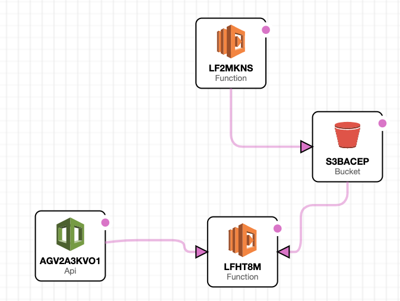

[](https://travis-ci.com/romdj/3point-game-nhl-standing)

# NHL 3 Point System

---
## About this Project

This effort is purely to make it easier for stats nerds and the like to make and showcase what the NHL standings would be if the Games were worth 3 points, hence abiding to IIHF rules and not _artificially_ narrowing the gap between teams. 

## Roadmap

So far, the back-end is done (fetching and organising data)
Here is what remains to be done:
- Front-end development (Vue or Svelte TBD)
- Deployment to AWS || GCP
- Storing data in Cache/DB

## Stack Architecture
Here is a very simple diagram of what the architecture looks like:


## Contributing

I am only one person so if you see something I have missed please feel free to 
open up a MR/PR and I will get it merged.  Generally speaking I get things done
in a few days as time permits between work and other obligations.

## Contact
You can reach me by mp, I'll think if Gitter makes sense, but since this is probably a very insignificant project, I don't expect an overwhelming popularity :grin:

## Acknowledgements

[Drew Hynes](https://gitlab.com/dword4/nhlapi) This is the resource that really got me bootstraped to this project.

By inheritance, I also have to thank the 2 following developer along with their projects.

[Kevin Sidwar](https://www.kevinsidwar.com/) - First real source of documentation I found on the API and gave me
a nice starting point for a project that eventually evolved into this repository

[Jon Ursenbach](https://github.com/erunion) - Built out an [OpenAPI 3 spec](https://github.com/erunion/sport-api-specifications) for the NHL API <!-- AUTO-GENERATED-CONTENT:START (STARTER) -->
<p align="center">
  <a href="https://www.gatsbyjs.org">
    
  </a>
</p>
<h1 align="center">
  Gatsby's default starter
</h1>

Kick off your project with this default boilerplate. This starter ships with the main Gatsby configuration files you might need to get up and running blazing fast with the blazing fast app generator for React.

_Have another more specific idea? You may want to check out our vibrant collection of [official and community-created starters](https://www.gatsbyjs.org/docs/gatsby-starters/)._

## 🚀 Quick start

1.  **Create a Gatsby site.**

    Use the Gatsby CLI to create a new site, specifying the default starter.

    ```shell
    # create a new Gatsby site using the default starter
    gatsby new my-default-starter https://github.com/gatsbyjs/gatsby-starter-default
    ```

1.  **Start developing.**

    Navigate into your new site’s directory and start it up.

    ```shell
    cd my-default-starter/
    gatsby develop
    ```

1.  **Open the source code and start editing!**

    Your site is now running at `http://localhost:8000`!

    _Note: You'll also see a second link: _`http://localhost:8000/___graphql`_. This is a tool you can use to experiment with querying your data. Learn more about using this tool in the [Gatsby tutorial](https://www.gatsbyjs.org/tutorial/part-five/#introducing-graphiql)._

    Open the `my-default-starter` directory in your code editor of choice and edit `src/pages/index.js`. Save your changes and the browser will update in real time!

## 🧐 What's inside?

A quick look at the top-level files and directories you'll see in a Gatsby project.

    .
    ├── node_modules
    ├── src
    ├── .gitignore
    ├── .prettierrc
    ├── gatsby-browser.js
    ├── gatsby-config.js
    ├── gatsby-node.js
    ├── gatsby-ssr.js
    ├── LICENSE
    ├── package-lock.json
    ├── package.json
    └── README.md

1.  **`/node_modules`**: This directory contains all of the modules of code that your project depends on (npm packages) are automatically installed.

2.  **`/src`**: This directory will contain all of the code related to what you will see on the front-end of your site (what you see in the browser) such as your site header or a page template. `src` is a convention for “source code”.

3.  **`.gitignore`**: This file tells git which files it should not track / not maintain a version history for.

4.  **`.prettierrc`**: This is a configuration file for [Prettier](https://prettier.io/). Prettier is a tool to help keep the formatting of your code consistent.

5.  **`gatsby-browser.js`**: This file is where Gatsby expects to find any usage of the [Gatsby browser APIs](https://www.gatsbyjs.org/docs/browser-apis/) (if any). These allow customization/extension of default Gatsby settings affecting the browser.

6.  **`gatsby-config.js`**: This is the main configuration file for a Gatsby site. This is where you can specify information about your site (metadata) like the site title and description, which Gatsby plugins you’d like to include, etc. (Check out the [config docs](https://www.gatsbyjs.org/docs/gatsby-config/) for more detail).

7.  **`gatsby-node.js`**: This file is where Gatsby expects to find any usage of the [Gatsby Node APIs](https://www.gatsbyjs.org/docs/node-apis/) (if any). These allow customization/extension of default Gatsby settings affecting pieces of the site build process.

8.  **`gatsby-ssr.js`**: This file is where Gatsby expects to find any usage of the [Gatsby server-side rendering APIs](https://www.gatsbyjs.org/docs/ssr-apis/) (if any). These allow customization of default Gatsby settings affecting server-side rendering.

9.  **`LICENSE`**: Gatsby is licensed under the MIT license.

10. **`package-lock.json`** (See `package.json` below, first). This is an automatically generated file based on the exact versions of your npm dependencies that were installed for your project. **(You won’t change this file directly).**

11. **`package.json`**: A manifest file for Node.js projects, which includes things like metadata (the project’s name, author, etc). This manifest is how npm knows which packages to install for your project.

12. **`README.md`**: A text file containing useful reference information about your project.

## 🎓 Learning Gatsby

Looking for more guidance? Full documentation for Gatsby lives [on the website](https://www.gatsbyjs.org/). Here are some places to start:

- **For most developers, we recommend starting with our [in-depth tutorial for creating a site with Gatsby](https://www.gatsbyjs.org/tutorial/).** It starts with zero assumptions about your level of ability and walks through every step of the process.

- **To dive straight into code samples, head [to our documentation](https://www.gatsbyjs.org/docs/).** In particular, check out the _Guides_, _API Reference_, and _Advanced Tutorials_ sections in the sidebar.

## 💫 Deploy

[](https://app.netlify.com/start/deploy?repository=https://github.com/gatsbyjs/gatsby-starter-default)

[](https://vercel.com/import/project?template=https://github.com/gatsbyjs/gatsby-starter-default)

<!-- AUTO-GENERATED-CONTENT:END -->
